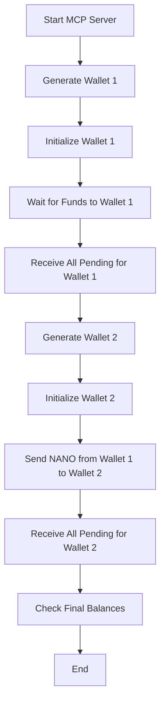

# MCP (Nano Cryptocurrency) Server

## What is NANO Cryptocurrency?

NANO is a sustainable digital currency with instant transactions and zero fees, making it ideal for AI systems and automated transactions. Unlike traditional cryptocurrencies, NANO uses a unique block-lattice architecture and a Delegated Proof of Stake (DPoS) consensus mechanism called Open Representative Voting (ORV).

### Why NANO is Unique for AI Applications:

1. **Instant Transactions**: Perfect for real-time AI decision-making and automated systems
2. **Zero Fees**: Enables micro-transactions and continuous AI-driven operations without cost overhead
3. **Energy Efficient**: Uses minimal computational resources, making it environmentally friendly
4. **Scalability**: Block-lattice architecture allows parallel processing of transactions
5. **Deterministic Finality**: Provides immediate transaction confirmation, crucial for AI systems
6. **Asynchronous Operations**: Ideal for distributed AI systems and parallel processing

## 📁 Project Structure

```
mcp-nano/
├── src/
│   ├── index.js          # Main server entry point
│   ├── server.js         # MCP server implementation
│   └── swagger.js        # API documentation
├── utils/
│   └── nano-transactions.js  # Nano transaction handling
├── tests/
│   └── full-flow-test.ps1    # Integration tests
├── package.json
└── README.md
```

## 🚀 Prerequisites

- Node.js 16+ (as specified in package.json)
- Express.js for HTTP server
- Nano cryptocurrency libraries:
  - nanocurrency
  - nanocurrency-web
- Additional dependencies:
  - body-parser
  - swagger-ui-express
  - swagger-jsdoc
  - ajv (for schema validation)

## 🛠️ Implementation Details

### Tool Registration Pattern

Our MCP server implements JSON-RPC 2.0 protocol with the following request format:

```json
{
  "jsonrpc": "2.0",
  "method": "methodName",
  "params": {
    // Method-specific parameters
  },
  "id": 1
}
```

#### Method Specifications

1. **initialize**
   ```typescript
   // Request
   {
     "jsonrpc": "2.0",
     "method": "initialize",
     "params": {},
     "id": 1
   }
   
   // Response
   {
     "jsonrpc": "2.0",
     "result": {
       "version": "1.0.0",
       "capabilities": {
         "methods": [
           "initialize",
           "generateWallet",
           "getBalance",
           "initializeAccount",
           "sendTransaction",
           "receiveAllPending",
           "getAccountInfo",
           "getPendingBlocks",
           "generateWork"
         ]
       }
     },
     "id": 1
   }
   ```

2. **generateWallet**
   ```typescript
   // Request
   {
     "jsonrpc": "2.0",
     "method": "generateWallet",
     "params": {},
     "id": 1
   }
   
   // Response
   {
     "jsonrpc": "2.0",
     "result": {
       "publicKey": string,    // 64 character hex string
       "privateKey": string,   // 64 character hex string
       "address": string       // nano_ prefixed address
     },
     "id": 1
   }
   ```

3. **getBalance**
   ```typescript
   // Request
   {
     "jsonrpc": "2.0",
     "method": "getBalance",
     "params": {
       "address": string      // nano_ prefixed address
     },
     "id": 1
   }
   
   // Response
   {
     "jsonrpc": "2.0",
     "result": {
       "balance": string,     // Raw balance in string format
       "pending": string      // Raw pending balance in string format
     },
     "id": 1
   }
   ```

4. **getAccountInfo**
   ```typescript
   // Request
   {
     "jsonrpc": "2.0",
     "method": "getAccountInfo",
     "params": {
       "address": string      // nano_ prefixed address
     },
     "id": 1
   }
   
   // Response
   {
     "jsonrpc": "2.0",
     "result": {
       "frontier": string,    // Latest block hash
       "open_block": string,  // First block hash
       "representative_block": string,  // Representative block hash
       "balance": string,     // Raw balance
       "modified_timestamp": string,    // Last modified timestamp
       "block_count": string, // Number of blocks
       "representative": string,        // Representative address
       "weight": string,      // Account weight
       "pending": string      // Raw pending balance
     },
     "id": 1
   }
   ```

5. **getPendingBlocks**
   ```typescript
   // Request
   {
     "jsonrpc": "2.0",
     "method": "getPendingBlocks",
     "params": {
       "address": string      // nano_ prefixed address
     },
     "id": 1
   }
   
   // Response
   {
     "jsonrpc": "2.0",
     "result": {
       "blocks": {
         [blockHash: string]: {
           "amount": string,  // Raw amount
           "source": string   // Source address
         }
       }
     },
     "id": 1
   }
   ```

6. **initializeAccount**
   ```typescript
   // Request
   {
     "jsonrpc": "2.0",
     "method": "initializeAccount",
     "params": {
       "address": string,     // nano_ prefixed address
       "privateKey": string   // 64 character hex string
     },
     "id": 1
   }
   
   // Response
   {
     "jsonrpc": "2.0",
     "result": {
       "initialized": boolean,
       "representative": string  // nano_ prefixed address
     },
     "id": 1
   }
   ```

7. **sendTransaction**
   ```typescript
   // Request
   {
     "jsonrpc": "2.0",
     "method": "sendTransaction",
     "params": {
       "fromAddress": string,    // nano_ prefixed address
       "toAddress": string,      // nano_ prefixed address
       "amountRaw": string,      // Raw amount in string format
       "privateKey": string      // 64 character hex string
     },
     "id": 1
   }
   
   // Response
   {
     "jsonrpc": "2.0",
     "result": {
       "success": boolean,
       "hash": string,           // Transaction hash
       "amount": string,         // Raw amount sent
       "balance": string         // New balance after transaction
     },
     "id": 1
   }
   ```

8. **receiveAllPending**
   ```typescript
   // Request
   {
     "jsonrpc": "2.0",
     "method": "receiveAllPending",
     "params": {
       "address": string,     // nano_ prefixed address
       "privateKey": string   // 64 character hex string
     },
     "id": 1
   }
   
   // Response
   {
     "jsonrpc": "2.0",
     "result": {
       "received": Array<{
         "hash": string,      // Block hash
         "amount": string,    // Raw amount received
         "source": string     // Source address
       }>
     },
     "id": 1
   }
   ```

9. **generateWork**
   ```typescript
   // Request
   {
     "jsonrpc": "2.0",
     "method": "generateWork",
     "params": {
       "hash": string,        // Block hash to generate work for
       "isOpen": boolean      // Whether this is an open block
     },
     "id": 1
   }
   
   // Response
   {
     "jsonrpc": "2.0",
     "result": {
       "work": string        // 16 character hex string
     },
     "id": 1
   }
   ```

#### Error Response Format
All methods may return the following error format:
```typescript
{
  "jsonrpc": "2.0",
  "error": {
    "code": number,      // Error code
    "message": string    // Error description
  },
  "id": number | null
}
```

Common error codes:
- `-32700`: Parse error
- `-32600`: Invalid request
- `-32601`: Method not found
- `-32602`: Invalid params
- `-32603`: Internal error
- `-32000`: Server error

#### Type Definitions
```typescript
// Common Types
type NanoAddress = string;  // nano_ prefixed address
type PrivateKey = string;   // 64 character hex string
type RawAmount = string;    // String representation of raw amount
type BlockHash = string;    // 64 character hex string
type Work = string;         // 16 character hex string

// Response Types
interface JsonRpcResponse<T> {
  jsonrpc: "2.0";
  result: T;
  id: number;
}

interface JsonRpcError {
  jsonrpc: "2.0";
  error: {
    code: number;
    message: string;
  };
  id: number | null;
}

// Method-specific Types
interface WalletResponse {
  publicKey: string;
  privateKey: string;
  address: NanoAddress;
}

interface BalanceResponse {
  balance: RawAmount;
  pending: RawAmount;
}

interface AccountInfoResponse {
  frontier: BlockHash;
  open_block: BlockHash;
  representative_block: BlockHash;
  balance: RawAmount;
  modified_timestamp: string;
  block_count: string;
  representative: NanoAddress;
  weight: string;
  pending: RawAmount;
}

interface PendingBlock {
  amount: RawAmount;
  source: NanoAddress;
}

interface PendingBlocksResponse {
  blocks: {
    [hash: BlockHash]: PendingBlock;
  };
}

interface TransactionResponse {
  success: boolean;
  hash: BlockHash;
  amount: RawAmount;
  balance: RawAmount;
}

interface ReceiveResponse {
  received: Array<{
    hash: BlockHash;
    amount: RawAmount;
    source: NanoAddress;
  }>;
}

interface WorkResponse {
  work: Work;
}
```

### Transport Options

The MCP server supports:

1. **HTTP/HTTPS Transport**
   - Express.js server running on port 3000 by default
   - Configurable via MCP_PORT environment variable
   - CORS enabled for cross-origin requests

2. **API Documentation**
   - Swagger UI available at `/api-docs`
   - OpenAPI/Swagger JSON at `/api-docs.json`
   - Interactive testing interface

3. **JSON-RPC 2.0 Protocol**
   - Standard JSON-RPC 2.0 request/response format
   - Error handling following JSON-RPC 2.0 specification
   - Batch requests support

### Development Commands

```bash
# Start the server
npm start

# Run tests
npm test

# View API documentation
# Visit http://localhost:3000/api-docs
```

### Best Practices

1. **Error Handling**
   - All errors follow JSON-RPC 2.0 error format
   - Proper error codes and messages
   - Detailed error logging

2. **Input Validation**
   - Schema validation for all method parameters
   - Type checking for numeric values
   - Address format validation

3. **Security**
   - Secure handling of private keys
   - Environment variable configuration
   - CORS headers configuration

4. **Logging**
   - Request/response logging
   - Error logging
   - Transaction logging

5. **Configuration**
   - Environment-based configuration
   - Default values for common settings
   - Customizable RPC endpoints

## Available Tools and Methods

Each tool in this implementation requires specific parameters and provides unique functionality for AI integration:

### Core Tools

| Tool | Required Parameters | Description |
|------|-------------------|-------------|
| `initialize` | None | Initializes the NANO server instance |
| `generateWallet` | None | Creates a new NANO wallet with address and private key |
| `getBalance` | `address` | Retrieves the current balance for a NANO address |
| `getAccountInfo` | `address` | Fetches detailed account information |
| `getPendingBlocks` | `address` | Lists pending incoming transactions |

### Transaction Tools

| Tool | Required Parameters | Description |
|------|-------------------|-------------|
| `initializeAccount` | `address`, `privateKey` | Prepares an account for transactions |
| `sendTransaction` | `fromAddress`, `toAddress`, `amountRaw`, `privateKey` | Executes a NANO transfer |
| `receiveAllPending` | `address`, `privateKey` | Processes all pending transactions for an account and actually receives funds (not just marks as receivable). Uses nanocurrency-web for block creation. |

## Getting Started

### Quick Start with NPX
The easiest way to start the server is using npx:

```bash
npx -y nano-mcp
```

### Installation Options

1. **Using npm:**
```bash
npm install nano-mcp
```

2. **Using yarn:**
```bash
yarn add nano-mcp
```

3. **Using pnpm:**
```bash
pnpm add nano-mcp
```

### Running the Server

After installation, you can start the server in several ways:

1. **Using npx:**
```bash
npx nano-mcp
```

2. **Using npm scripts:**
```bash
npm start
```

3. **Direct execution:**
```bash
node src/index.js
```

## API Methods

The server supports the following JSON-RPC 2.0 methods:

### Initialize Server
```json
{
  "jsonrpc": "2.0",
  "method": "initialize",
  "params": {},
  "id": 1
}
```

### Generate Wallet
```json
{
  "jsonrpc": "2.0",
  "method": "generateWallet",
  "params": {},
  "id": 1
}
```

### Get Balance
```json
{
  "jsonrpc": "2.0",
  "method": "getBalance",
  "params": {
    "address": "nano_..."
  },
  "id": 1
}
```

### Get Account Info
```json
{
  "jsonrpc": "2.0",
  "method": "getAccountInfo",
  "params": {
    "address": "nano_..."
  },
  "id": 1
}
```

### Get Pending Blocks
```json
{
  "jsonrpc": "2.0",
  "method": "getPendingBlocks",
  "params": {
    "address": "nano_..."
  },
  "id": 1
}
```

### Initialize Account
```json
{
  "jsonrpc": "2.0",
  "method": "initializeAccount",
  "params": {
    "address": "nano_...",
    "privateKey": "private_key_here"
  },
  "id": 1
}
```

### Send Transaction
```json
{
  "jsonrpc": "2.0",
  "method": "sendTransaction",
  "params": {
    "fromAddress": "nano_...",
    "toAddress": "nano_...",
    "amountRaw": "1000000000000000000000000",
    "privateKey": "private_key_here"
  },
  "id": 1
}
```

### Receive All Pending
```json
{
  "jsonrpc": "2.0",
  "method": "receiveAllPending",
  "params": {
    "address": "nano_...",
    "privateKey": "private_key_here"
  },
  "id": 1
}
```

## Step-by-Step Integration Guide

Here's a complete workflow for integrating with the NANO MCP Server:

1. **Start the Server**
   ```bash
   npx -y nano-mcp
   ```

2. **Generate a New Wallet**
   - Call the `generateWallet` method
   - Store the returned address, privateKey, and seed securely
   - This creates your first NANO account

3. **Initialize the Account**
   - Call `initializeAccount` with your address and privateKey
   - This prepares the account for transactions
   - Required before sending/receiving

4. **Check Account Balance**
   - Use `getBalance` to view your current balance
   - Use `getAccountInfo` for detailed account information
   - Check `getPendingBlocks` for any pending incoming transactions

5. **Receive Funds**
   - When someone sends you NANO, it appears as pending
   - Use `receiveAllPending` to claim all pending funds (funds will be actually received and reflected in your balance)
   - Requires your address and privateKey

6. **Send Funds**
   - Ensure you have sufficient balance
   - Use `sendTransaction` to transfer NANO to another address

7. **Monitor Transactions**
   - Regularly check `getBalance` and `getPendingBlocks`
   - Use `getAccountInfo` to verify transaction status
   - Process any pending receives with `receiveAllPending`

- After calling `receiveAllPending`, your account balance will increase and pending blocks will be cleared.

## Curl Examples

Below are ready-to-use curl commands organized by common scenarios. Replace addresses and keys with your own where needed.

### Receive Scenario

Follow these steps to receive NANO:

#### 1. Generate New Wallet
```powershell
# Generate Wallet
curl.exe -X POST http://localhost:8080/ -H "Content-Type: application/json" --data-binary @- << EOF
{
  "jsonrpc": "2.0",
  "method": "generateWallet",
  "params": {},
  "id": 1
}
EOF
```
Response will include: address, privateKey, publicKey, and seed. Save these securely.

#### 2. Check Account Info (Initial)
```powershell
# Get Account Info
curl.exe -X POST http://localhost:8080/ -H "Content-Type: application/json" --data-binary @- << EOF
{
  "jsonrpc": "2.0",
  "method": "getAccountInfo",
  "params": {
    "address": "nano_13f83is97pu3fo8jm1iu7yyi6pocab6hq6scc5qt8qqgdax8ybdmwbm4rcs3"
  },
  "id": 1
}
EOF
```
For new accounts, expect "Account not found" error (this is normal).

#### 3. Check Pending Blocks
```powershell
# Get Pending Blocks
curl.exe -X POST http://localhost:8080/ -H "Content-Type: application/json" --data-binary @- << EOF
{
  "jsonrpc": "2.0",
  "method": "getPendingBlocks",
  "params": {
    "address": "nano_13f83is97pu3fo8jm1iu7yyi6pocab6hq6scc5qt8qqgdax8ybdmwbm4rcs3"
  },
  "id": 1
}
EOF
```

#### 4. Generate Work (For First Receive)
```powershell
# Generate Work
curl.exe -X POST http://localhost:8080/ -H "Content-Type: application/json" --data-binary @- << EOF
{
  "jsonrpc": "2.0",
  "method": "generateWork",
  "params": {
    "hash": "05a60c3272db616d4d19821b2fbd025aaa4248fb932a50efa35eee5a3a6f2573",
    "isOpen": true
  },
  "id": 1
}
EOF
```

#### 5. Receive Pending
```powershell
# Receive Pending
curl.exe -X POST http://localhost:8080/ -H "Content-Type: application/json" --data-binary @- << EOF
{
  "jsonrpc": "2.0",
  "method": "receiveAllPending",
  "params": {
    "address": "nano_13f83is97pu3fo8jm1iu7yyi6pocab6hq6scc5qt8qqgdax8ybdmwbm4rcs3",
    "privateKey": "4bc2e9c2df4be93e5cbeb41b52c2fc9efc1b4c0e67951fc6c5098c117913d25aa"
  },
  "id": 1
}
EOF
```

#### 6. Check Final Balance
```powershell
# Get Balance
curl.exe -X POST http://localhost:8080/ -H "Content-Type: application/json" --data-binary @- << EOF
{
  "jsonrpc": "2.0",
  "method": "getBalance",
  "params": {
    "address": "nano_13f83is97pu3fo8jm1iu7yyi6pocab6hq6scc5qt8qqgdax8ybdmwbm4rcs3"
  },
  "id": 1
}
EOF
```

### Send Scenario

Follow these steps to send NANO:

#### 1. Check Source Account Balance
```powershell
# Get Source Balance
curl.exe -X POST http://localhost:8080/ -H "Content-Type: application/json" --data-binary @- << EOF
{
  "jsonrpc": "2.0",
  "method": "getBalance",
  "params": {
    "address": "nano_13f83is97pu3fo8jm1iu7yyi6pocab6hq6scc5qt8qqgdax8ybdmwbm4rcs3"
  },
  "id": 1
}
EOF
```

#### 2. Initialize Account (if not already)
```powershell
# Initialize Account
curl.exe -X POST http://localhost:8080/ -H "Content-Type: application/json" --data-binary @- << EOF
{
  "jsonrpc": "2.0",
  "method": "initializeAccount",
  "params": {
    "address": "nano_13f83is97pu3fo8jm1iu7yyi6pocab6hq6scc5qt8qqgdax8ybdmwbm4rcs3",
    "privateKey": "4bc2e9c2df4be93e5cbeb41b52c2fc9efc1b4c0e67951fc6c5098c117913d25aa"
  },
  "id": 1
}
EOF
```

#### 3. Send Transaction
```powershell
# Send Transaction
curl.exe -X POST http://localhost:8080/ -H "Content-Type: application/json" --data-binary @- << EOF
{
  "jsonrpc": "2.0",
  "method": "sendTransaction",
  "params": {
    "fromAddress": "nano_13f83is97pu3fo8jm1iu7yyi6pocab6hq6scc5qt8qqgdax8ybdmwbm4rcs3",
    "privateKey": "4bc2e9c2df4be93e5cbeb41b52c2fc9efc1b4c0e67951fc6c5098c117913d25aa",
    "toAddress": "nano_3qya5xpjfsbk3ndfebo9dsrj6iy6f6idmogqtn1mtzdtwnxu6rw3dz18i6xf",
    "amountRaw": "10000000000000000000000000"
  },
  "id": 1
}
EOF
```

#### 4. Check Final Balances
```powershell
# Get Final Balances (Source and Destination)
curl.exe -X POST http://localhost:8080/ -H "Content-Type: application/json" --data-binary @- << EOF
{
  "jsonrpc": "2.0",
  "method": "getBalance",
  "params": {
    "address": "nano_13f83is97pu3fo8jm1iu7yyi6pocab6hq6scc5qt8qqgdax8ybdmwbm4rcs3"
  },
  "id": 1
}
EOF
```

Note: The amount "10000000000000000000000000" in raw units equals 0.00001 NANO.

## Client Configuration

The MCP server can be configured in various client applications. Here are some example configurations:

### Claude Desktop Configuration
```json
{
  "mcpServers": {
    "nano": {
      "command": "npx",
      "args": ["-y", "nano-mcp"],
      "env": {
        "MCP_PORT": "8080",
        "NANO_RPC_URL": "https://rpc.nano.to",
        "NANO_RPC_KEY": "your-rpc-key"
      }
    }
  }
}
```

### Custom Configuration Examples

1. **Basic Configuration:**
```json
{
  "mcpServers": {
    "nano": {
      "command": "npx",
      "args": ["-y", "nano-mcp"]
    }
  }
}
```

2. **With Custom Port:**
```json
{
  "mcpServers": {
    "nano": {
      "command": "npx",
      "args": ["-y", "nano-mcp"],
      "env": {
        "MCP_PORT": "8080"
      }
    }
  }
}
```

3. **With Custom RPC Node:**
```json
{
  "mcpServers": {
    "nano": {
      "command": "npx",
      "args": ["-y", "nano-mcp"],
      "env": {
        "NANO_RPC_URL": "https://your-custom-node.com",
        "NANO_RPC_KEY": "your-rpc-key"
      }
    }
  }
}
```

4. **Complete Configuration:**
```json
{
  "mcpServers": {
    "nano": {
      "command": "npx",
      "args": ["-y", "nano-mcp"],
      "env": {
        "MCP_PORT": "8080",
        "NANO_RPC_URL": "https://rpc.nano.to",
        "NANO_RPC_KEY": "your-rpc-key",
        "NANO_REPRESENTATIVE": "nano_3qya5xpjfsbk3ndfebo9dsrj6iy6f6idmogqtn1mtzdtwnxu6rw3dz18i6xf"
      }
    }
  }
}
```

## Getting Started with NANO

### Free NANO Faucets
To get started with testing this MCP server, you can obtain free NANO (XNO) from various faucets:

1. **WeNano** - A location-based social wallet app where you can earn NANO through globally distributed spots
2. **XNOPay Faucet** - A payment processor offering free NANO
3. **Nano Drop** - Simple faucet for micro-fractions of NANO
4. **Nanswap Faucet** - Quick and easy way to get small amounts of NANO
5. **Prussia Nano Faucet** - Basic faucet with simple address input
6. **FreeNanoFaucet** - Learn about NANO while earning some

For a complete list of available faucets, visit: [https://hub.nano.org/faucets](https://hub.nano.org/faucets)

## Error Handling

All errors follow JSON-RPC 2.0 error format:

```json
{
  "jsonrpc": "2.0",
  "error": {
    "code": -32000,
    "message": "Error description here"
  },
  "id": 1
}
```

Common error codes:
- `-32700`: Parse error
- `-32600`: Invalid request
- `-32601`: Method not found
- `-32602`: Invalid params
- `-32603`: Internal error
- `-32000`: Server error

## API Documentation & Testing (Swagger UI)

The MCP server includes an interactive Swagger UI for API documentation and live testing.

### How to Use

1. **Start the server:**
   - Using npx:
     ```bash
     npx nano-mcp
     ```
   - Or using npm:
     ```bash
     npm start
     ```
   - Or directly:
     ```bash
     node src/index.js
     ```

2. **Open Swagger UI:**
   - Visit [http://localhost:8080/api-docs](http://localhost:8080/api-docs) in your browser.
   - You will see the full API documentation and can interactively test all endpoints.

3. **Try Out Methods:**
   - Use the "Try it out" button in Swagger UI to send requests to the server and see live responses.

4. **Swagger JSON:**
   - The raw OpenAPI/Swagger JSON is available at [http://localhost:8080/api-docs.json](http://localhost:8080/api-docs.json)

## License

MIT License

Copyright (c) 2025 Context

Permission is hereby granted, free of charge, to any person obtaining a copy
of this software and associated documentation files (the "Software"), to deal
in the Software without restriction, including without limitation the rights
to use, copy, modify, merge, publish, distribute, sublicense, and/or sell
copies of the Software, and to permit persons to whom the Software is
furnished to do so, subject to the following conditions:

The above copyright notice and this permission notice shall be included in all
copies or substantial portions of the Software.

THE SOFTWARE IS PROVIDED "AS IS", WITHOUT WARRANTY OF ANY KIND, EXPRESS OR
IMPLIED, INCLUDING BUT NOT LIMITED TO THE WARRANTIES OF MERCHANTABILITY,
FITNESS FOR A PARTICULAR PURPOSE AND NONINFRINGEMENT. IN NO EVENT SHALL THE
AUTHORS OR COPYRIGHT HOLDERS BE LIABLE FOR ANY CLAIM, DAMAGES OR OTHER
LIABILITY, WHETHER IN AN ACTION OF CONTRACT, TORT OR OTHERWISE, ARISING FROM,
OUT OF OR IN CONNECTION WITH THE SOFTWARE OR THE USE OR OTHER DEALINGS IN THE
SOFTWARE. 

## Full Flow Testing

### End-to-End Flow Diagram



### PowerShell Full Flow Test Script (Windows)
```powershell
# tests/full-flow-test.ps1
# Colors for better visibility
$Green = [System.ConsoleColor]::Green
$Yellow = [System.ConsoleColor]::Yellow
$Red = [System.ConsoleColor]::Red

Write-Host "Starting NANO MCP Full Flow Test" -ForegroundColor $Green
Write-Host "----------------------------------------"

# ... (rest of the script, see tests/full-flow-test.ps1) ...
```

### Bash Full Flow Test Script (Linux/macOS)
```bash
# tests/full-flow-test.sh
#!/bin/bash

# Colors for better visibility
GREEN='\033[0;32m'
YELLOW='\033[1;33m'
NC='\033[0m'

# ... (rest of the script, see tests/full-flow-test.sh) ...
```

### Example Output Log
```
Starting NANO MCP Full Flow Test
----------------------------------------
Initializing server...
Server initialized successfully
----------------------------------------
Loading saved Wallet 1...
Wallet 1 loaded successfully
Wallet 1 Address: nano_3eadyjzpjfocpigqauajzhe1y41z939rhbjdmbed5zxs75hzqswpojus3b3f
----------------------------------------
Initializing Wallet 1...
Wallet 1 initialized successfully
----------------------------------------
Waiting for initial funds to Wallet 1...
Please send 0.0001 NANO to: nano_3eadyjzpjfocpigqauajzhe1y41z939rhbjdmbed5zxs75hzqswpojus3b3f
Checking for incoming transaction every 10 seconds...
...
Test Complete!
Wallet 1 final balance: 99800000000000000000000000 raw (0 NANO)
Wallet 2 final balance: 200000000000000000000000 raw (0 NANO)
```

## Example MCP Crypto Prompt Templates

### 1. Automated Micro-Payments for AI Services
**Prompt Template:**
```
You are an AI assistant that charges per response. When a user sends a question, generate a new Nano wallet, request a micro-payment (e.g., 0.00001 NANO) to that address, and only answer after the payment is received. Use MCP's `generateWallet`, `getPendingBlocks`, and `receiveAllPending` methods to automate the process.
```
**Use Case:** Pay-per-use AI APIs, paywalled chatbots, or micro-transaction-based content unlocks.

---

### 2. Instant Payouts for Task Automation
**Prompt Template:**
```
When a user completes a task (e.g., labeling data, solving a captcha, or providing feedback), automatically send a reward in NANO to their provided address using MCP's `sendTransaction`. Confirm the transaction and provide a receipt using `getBalance` and `getAccountInfo`.
```
**Use Case:** Crowdsourcing platforms, micro-tasking, or instant gig economy payouts.

---

### 3. Onboarding New Users with Welcome Bonus
**Prompt Template:**
```
On user registration, generate a new Nano wallet for them using `generateWallet`, initialize the account with `initializeAccount`, and send a small welcome bonus using `sendTransaction`. Guide the user to claim their bonus by calling `receiveAllPending` and show their balance.
```
**Use Case:** Crypto onboarding, faucet services, or incentivized sign-ups.

---

### 4. Recurring Subscription Payments
**Prompt Template:**
```
Set up a recurring payment system where users must send a fixed amount of NANO to a service address every month. Use MCP's `getPendingBlocks` and `receiveAllPending` to monitor and claim incoming subscription payments, and `getBalance` to verify active status.
```
**Use Case:** Subscription-based SaaS, pay-as-you-go APIs, or membership clubs.

---

### 5. Peer-to-Peer Tipping and Donations
**Prompt Template:**
```
Allow users to tip or donate to each other by entering a recipient's Nano address and amount. Use MCP's `sendTransaction` to process the tip, and `receiveAllPending` on the recipient's side to claim it. Show confirmation and updated balances using `getAccountInfo`.
```
**Use Case:** Social platforms, content creator tipping, or charity donation bots.

--- 